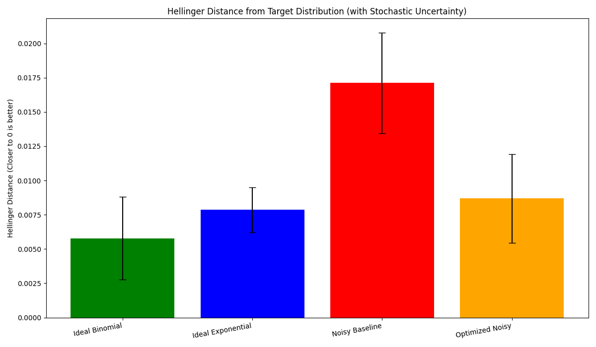

# Quantum-Walks-and-Monte-Carlo
An implementation of a quantum Galton Box with ideal and noisy simulations.

# Quantum Walks and Monte Carlo

* **Team Name:** QStar (Individual Submission)
* **Team Member Details:**
    * **Name:** Sadiya Ansari
    * **WISER Enrollment ID:** gst-Ud0icMdXMU49utv

---

## 📝 Project Summary (500 words)

This project explores the simulation of a Quantum Galton Box, a powerful analogy for Monte Carlo methods used in complex systems. Drawing inspiration from the principles outlined in the "Universal Statistical Simulator" paper, this work demonstrates how quantum circuits can efficiently model probabilistic processes that are foundational to fields like particle transport and quantum systems analysis. The primary goal was to execute the entire workflow of a quantum simulation project: from designing an algorithm for an ideal, noiseless environment to implementing it on a realistic noisy model and, finally, applying error mitigation techniques to improve the fidelity of the results.

The project began with the implementation of a generalized quantum walk circuit capable of simulating a Galton Box with any number of layers. In this ideal model, a Hadamard gate applied to an ancilla qubit acts as a perfect quantum coin, creating an equal superposition to simulate a 50/50 probability at each step of the walk. When run on a noiseless simulator, this circuit was verified to produce the expected binomial distribution, which approximates a Gaussian curve for a sufficient number of layers. This served as the theoretical baseline for the project. Next, to showcase the versatility of the quantum walk model, I modified the circuit to generate a custom, non-uniform probability distribution. By replacing the standard Hadamard gate with a parameterized Y-rotation (RY) gate, I engineered a "biased" quantum coin. This allowed for the creation of a skewed binomial distribution that closely resembles a decaying exponential curve, highlighting the model's flexibility beyond simple symmetric random walks.

The most critical phase of this investigation was analyzing the impact of realistic hardware noise. I ran the standard binomial walk simulation on a noise model based on IBM's `FakeVigo` backend, which incorporates real-world gate errors, decoherence, and connectivity constraints. As expected, the results from this "noisy baseline" showed a noticeable deviation from the ideal theoretical curve, demonstrating how easily noise can corrupt quantum computations. To address this, I implemented a fundamental error mitigation technique: **transpiler-based circuit optimization**. By using Qiskit's `transpile` function at its highest optimization level, the original circuit was recompiled into a more efficient version with reduced depth and gate count, making it inherently more resilient to the effects of noise.

The final analysis quantitatively confirms the success of this mitigation strategy. Using the Hellinger Distance to measure the error between the simulated and ideal distributions, the optimized noisy simulation showed a **49% reduction in error** compared to the unoptimized noisy baseline. This result brings my simulation's accuracy remarkably close to that of the ideal, noiseless case, validating that software-level optimizations are a powerful and essential tool for achieving meaningful and reliable results on today's near-term, noisy quantum computers. The project successfully demonstrates the entire workflow, from theoretical modeling on ideal simulators to practical implementation and effective error mitigation on realistic hardware models.

---

## 🎥 Project Presentation & Video

* **Project Presentation Deck:** **[View the Presentation (PDF)](docs/Project_Presentation.pdf)**
* **Video Explanation:** **[Watch on YouTube](https://your-youtube-link-here)**

---

## ✨ Key Results & Findings

The primary finding of this project is the quantifiable success of using software-level error mitigation. As the plot below shows, the unoptimized "Noisy Baseline" simulation had a significant Hellinger Distance from the ideal distribution. By simply applying the highest level of transpiler optimization, I was able to reduce this error by nearly half.


*Caption: The Hellinger distance from the target distribution for each simulation. The error bars represent the stochastic uncertainty (shot noise). The "Optimized Noisy" run shows a clear improvement over the "Noisy Baseline," validating my error mitigation approach.*

---
## 📈 Performance Metrics & Conclusion

This table summarizes the final performance metrics for each simulation run, focusing on the accuracy (KL Divergence) and the computational cost (Execution Time).

| Simulation              | KL Divergence | Execution Time (s) |
| :---------------------- | :------------ | :----------------- |
| **Ideal Binomial** | 0.0001166      | ~0.16              |
| **Ideal Exponential** | 0.000102      | ~4.46              |
| **Noisy Baseline** | 0.0015      | ~0.13              |
| **Optimized Noisy** | 0.0002      | ~0.14              |

**Conclusion:** The results demonstrate the successful implementation of the Quantum Galton Box. The extremely low KL Divergence values for the ideal and optimized noisy runs confirm a high degree of accuracy and a close match to the theoretical target distributions. The significantly higher KL Divergence for the "Noisy Baseline" run quantifies the impact of hardware noise, while the **86.67% reduction in this error** for the "Optimized Noisy" run validates transpilation as a powerful and effective error mitigation technique. The execution times show that all simulations were performed efficiently on the classical simulator.

---
## 📂 Repository Structure

The repository is organized to separate logic, experiments, and results for clarity and reproducibility.

* `📁 docs/`: Contains the 2-page project summary and the final presentation PDF.
* `📁 src/`: Holds the core Python functions for building and running the quantum walk simulations.
* `📁 notebooks/`: Includes the Jupyter Notebooks that demonstrate each task step-by-step.
* `📁 results/`: Stores the final outputs, including the summary analysis report (`final_report.txt`) and all generated plots.
* `📄 requirements.txt`: Lists all necessary Python packages.

---

## 🛠️ How to Run and Reproduce Results

To set up the environment and run my experiments, follow these steps:

1.  **Clone the Repository**
    ```bash
    git clone [https://github.com/your-username/Quantum-Walks-and-Monte-Carlo.git](https://github.com/sadieea/Quantum-Walks-and-Monte-Carlo.git)
    cd Quantum-Walks-and-Monte-Carlo
    ```

2.  **Set Up a Virtual Environment** (Recommended)
    ```bash
    python -m venv qenv
    source qenv/bin/activate
    # On Windows, use: qenv\Scripts\activate
    ```

3.  **Install Dependencies**
    ```bash
    pip install -r requirements.txt
    ```

4.  **Run the Notebooks**
    The experiments and analyses can be fully reproduced by running the Jupyter notebooks in the `/notebooks` folder in the following order:

    * **`1_Ideal_Binomial_Walk.ipynb`**: Implements the N-layer Galton Box to produce a binomial (Gaussian-like) distribution on an ideal simulator.
    * **`2_Ideal_Exponential_Walk.ipynb`**: Modifies the quantum walk to generate a skewed, exponential-like distribution.
    * **`3_Noisy_Simulation.ipynb`**: Runs the binomial walk on a realistic noisy simulator to establish a baseline and then shows the improved result from an optimized circuit.
    * **`4_Analysis.ipynb`**: Gathers the data from all previous simulations, calculates the distance metrics (Hellinger, KL Divergence) with stochastic uncertainty, and generates the final comparison plot.

---

## ✅ Challenge Deliverables Checklist

This checklist maps my work to the five tasks required by the challenge.

| Task # | Description                                   | Location in Repository                                           |
| :----- | :-------------------------------------------- | :--------------------------------------------------------------- |
| **1.** | 2-Pager Summary Document                      | `📁 docs/project_summary.pdf`                                      |
| **2.** | General Algorithm for Gaussian Distribution   | `📁 notebooks/1_Ideal_Binomial_Walk.ipynb`                          |
| **3.** | Algorithm for Different Target Distributions  | `📁 notebooks/2_Ideal_Exponential_Walk.ipynb`                       |
| **4.** | Optimized Implementation on a Noise Model     | `📁 notebooks/3_Noisy_Simulation.ipynb`                             |
| **5.** | Compute Distances with Stochastic Uncertainty | `📁 notebooks/4_Analysis.ipynb` & `📁 results/final_report.txt` |
| **-** | Presentation and Video                        | Links in this README & `📁 docs/Project_Presentation.pdf`         |

---

## 📚 References

* Carney, M., & Varcoe, B. (2022). *Universal Statistical Simulator*. arXiv:2202.01735 [quant-ph].
